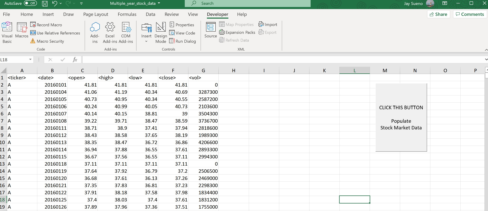
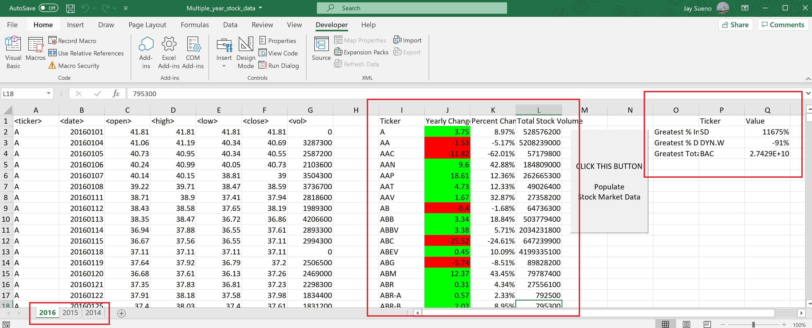
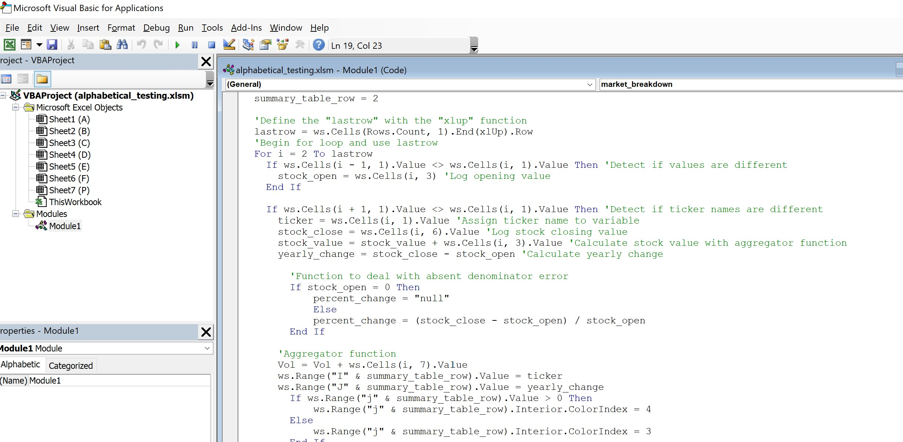

# Microsoft VBA Scripting Example
### Written by Jay Sueno
_Excel, VBA, Macros, Conditional Formatting_

In this project, I automate an Excel workbook to pull relevant data from thousands of rows in multiple worksheet and outputs summary columns of the stocks. This is done using a macro and VBA script. This script retrieves values, calculates simple arithmetic functions, and returns summary tables of the stock market data.

## Files

* alphabetical_testing.xlsm - file to test script on with smaller dataset
* Multiple_year_stock_data.xlsm - multiple year stock database, large file
* VBA_stockmarket.bas - VBA code to run stock market macro

## About the Code

* To read the VBA script: open "Sub market_breakdown().vb"
* Created a "sub" function to run the macro script
* Defined different variables: doubles, floats, string
* "lastrow" function utilizes the "xlup" function: "ws.Cells(Rows.Count, 1).End(xlUp).Row"
* Ran multiple for loops to find, aggregate, and store values
* Populated cells with desired outputs with "ws.range"
* Looped through the worksheets within the workbook using "ws." to define the current worksheet, then looping through the next worksheet with "Next ws" function

## Deployment

1. For faster example: open "alphabetical_testing.xlsm"
2. For the multi-year stock market breakdown: open "Multiple_year_stock_data.xlsm"

## Images

1. Pre macro

2. Post macro - press the button and the output and summary values populate the worksheets

3. Look into the VBA script

### About the Data

Data is in Excel format. It was pulled from Quandl and consist of alphabetically and yearly organized worksheets.

### To learn more about Jay Sueno visit his [LinkedIn Profile](https://www.linkedin.com/in/jay-sueno-359a274/)

##### All rights reserved 2020. All code is created and owned by Jay Sueno. If you use his code, please visit his LinkedIn and give him a a skill endorsement in python and data science. Visit him at: https://www.linkedin.com/in/jay-sueno-359a274/